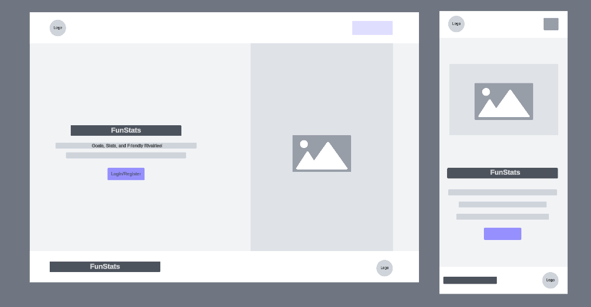
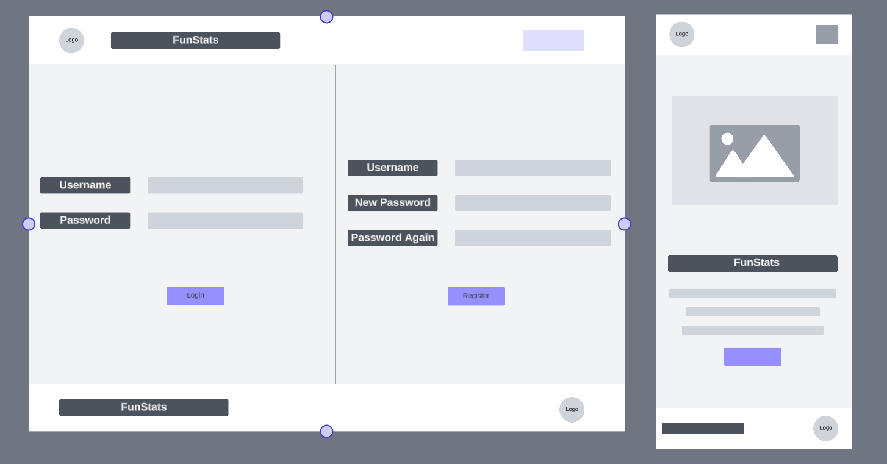
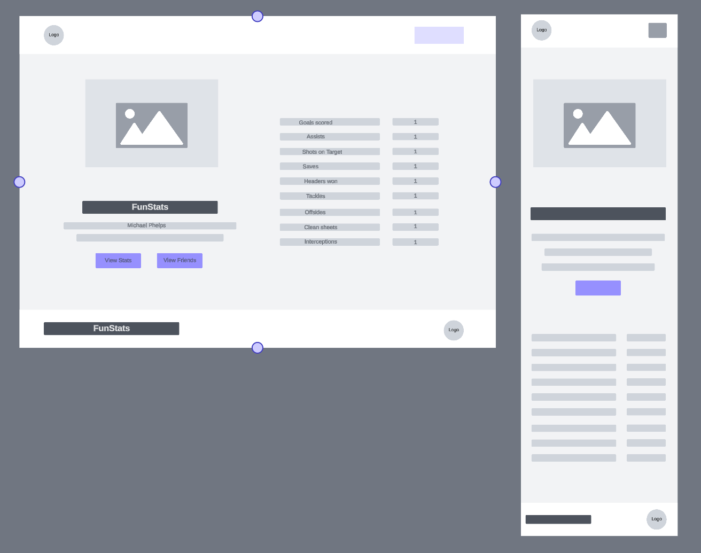
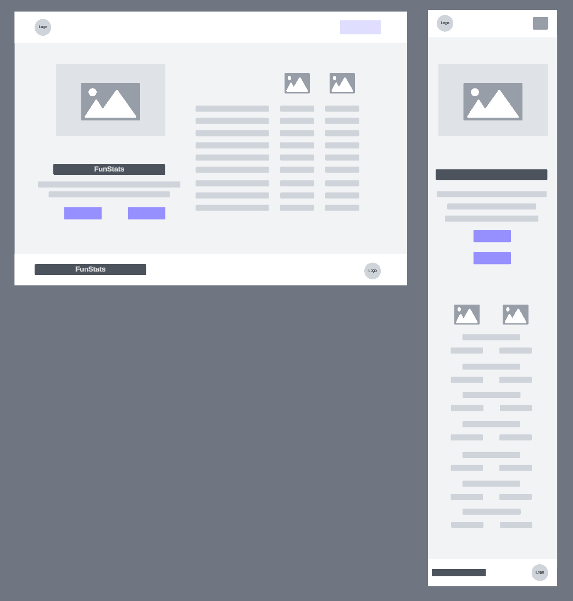
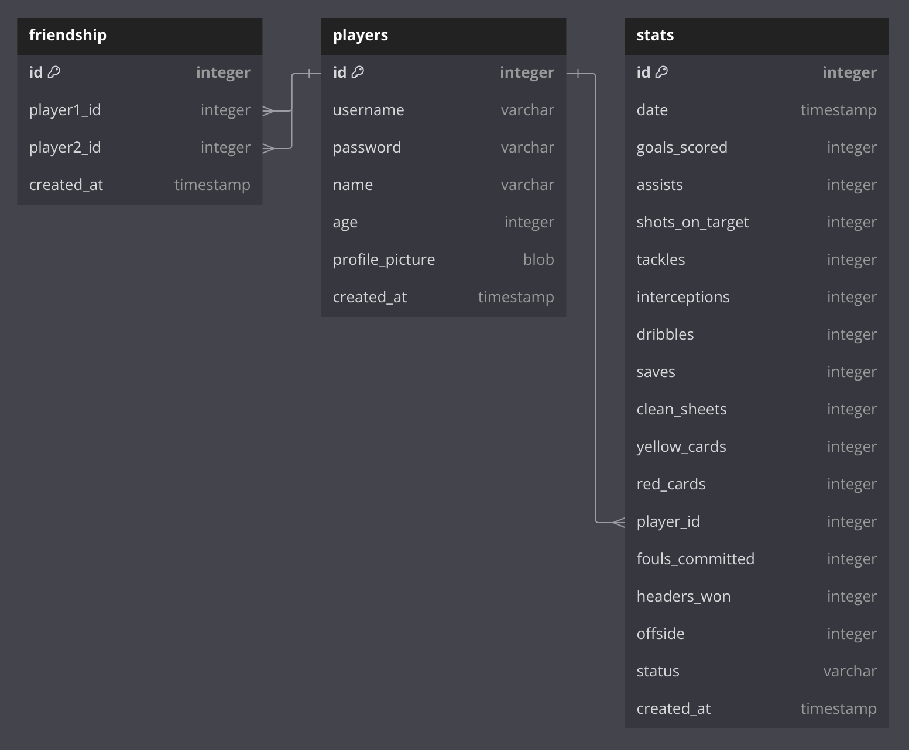

# Project Title

FunStats

## Overview

FunStats is an app for kids who play soccer to add their stats and compare them to their friends, and also possibly set stat goals to earn rewards.

### Problem

Kids who play soccer (or any other sport for that matter) are typically competitive and often compare their stats with friends (or even siblings) who are players on their team, or other teams especially if they go to the same school. They usually have to rely on their memory (which can sometimes lead to conflict) as most sport teams use apps with features that are mainly focused on scheduling games and practices, as well as updating the whole team stats (games won and games lost). They do not have robust features for individual players to view and update their stats. The kids will not only be able to compare their stats with their friends, this will also help to boost their motivation to keep playing as they observe their skills progressively improve.

### User Profile

- Kid soccer players:
  - looking to be able to view and update their game season stats
  - looking to compare their stats with friends
  - looking to earn/give rewards as the stats improve

### Features

- As a player, I want to be able to create an account to manage my stats
- As a player, I want to be able to login to my account to manage my stats
- As a logged in player, I want to be able to view, update and/or add new stats after each game
- As a logged in player, a modal with a famous soccer player's image and stats is displayed each time I add a new stat giving the opportunity to earn points if I can guess his name correctly.
- As a logged in player, I want to be able to add other players as friends
- As a logged in player, I want to be able to compare my stats to a friend's

## Implementation

### Tech Stack

- React
- TypeScript
- MySQL
- Express
- Client libraries:
  - react
  - react-router
  - axios
    react-bootstrap
- Server libraries:
  - knex
  - express
  - dotenv

### APIs

- No external APIs will be used for the first sprint

### Sitemap

- Home page
- Profile page
- Friends page
- View + Compare Stats
- Register
- Login

### Mockups

#### Home Page



#### Register/Login Page



#### Profile Page

#### Friends Page

#### View Stats Page (own stats only)



#### View Stats Page (compared state)



#### Update Stats Page

### Data



```
Table players (
  id INTEGER PRIMARY KEY
  username VARCHAR
  password VARCHAR
  name VARCHAR
  age INTEGER
  profile_picture BLOB
  created_at TIMESTAMP
)

CREATE TABLE friendship (
  player1_id INTEGER NOT NULL,
  player2_id INTEGER NOT NULL,
  date TIMESTAMP,
  PRIMARY KEY (player1_id, player2_id),
  CONSTRAINT player1_player2_ids CHECK (player1_id < player2_id)
);

CREATE TABLE stats (
  id INTEGER PRIMARY KEY
  date TIMESTAMP
  goals_scored INTEGER
  assists INTEGER
  shots_on_target INTEGER
  tackles INTEGER
  interceptions INTEGER
  dribbles INTEGER
  saves INTEGER
  clean_sheets INTEGER
  yellow_cards INTEGER
  red_cards INTEGER
  player_id INTEGER REFERENCES players.id
  fouls_committed INTEGER
  headers_won INTEGER
  offside INTEGER
  status VARCHAR
  created_at TIMESTAMP
)

CREATE TABLE famous_soccer_players (
  id INTEGER PRIMARY KEY
  name VARCHAR
  picture VARCHAR
  goals_scored INTEGER
  assists INTEGER
  shots_on_target INTEGER
  tackles INTEGER
  interceptions INTEGER
  dribbles INTEGER
  saves INTEGER
  clean_sheets INTEGER
  yellow_cards INTEGER
  red_cards INTEGER
  player_id INTEGER
  fouls_committed INTEGER
  headers_won INTEGER
  offside INTEGER
  status VARCHAR
  created_at TIMESTAMP
)
```

### Endpoints

**GET /profile**

- Get player profile

**GET /friends**

- Get player's friends list

**GET /friends/:id(or :playername)/stats**

- Get friend stats to compare

**POST /stats**

**PUT /stats/:id**

- Logged in player can update their rating of a café

Parameters:

- id: Stats id
- token: JWT of the logged in player
- rating: Number Rating out of 5 in 0.5 increments

**POST /players/register**

- Add a player account

Parameters:

- playername: Player's playername
- password: Player's password

Response:

```
{
    "token": "seyJhbGciOiJIUzI1NiIsInR5cCI6IkpXVCJ9.eyJzdWIiOiIxMjM0NTY3ODkwIiwibmFtZSI6I..."
}
```

**POST /players/login**

- Login a player

Parameters:

- playername: Player's playername
- password: Player's password

Response:

```
{
    "token": "seyJhbGciOiJIUzI1NiIsInR5cCI6IkpXVCJ9.eyJzdWIiOiIxMjM0NTY3ODkwIiwibmFtZSI6I..."
}
```

## Roadmap

- Create client

  - react project with routes and boilerplate pages

- Create server

  - express project with routing, with placeholder 200 responses

- Create migrations

- Create seeds with sample player data

- Deploy client and server projects so all commits will be reflected in production

- Feature: View stats
  - Implement view stats page using logged in player id
  - Store player id in sessionStorage
  - Create GET /stats
- Feature: Update Stats

  - Add form input to enter stats to update
  - Create POST /stats/:id
  - State for update stats

- Feature: Compare player stats
  - Add form input to enter friend's playername on view stats page
  - Chain GET /players/:id and GET /stats to first get player id and the get the stats for the player
- Feature: Add friend

  - Implement Friends page
  - Create GET /player/:playername
  - States for add & remove friend

- Feature: Home page

- Feature: Create account

  - Implement player register page + form
  - Create POST /players/register endpoint

- Feature: Login
  - Implement login page + form
  - Create POST /players/login endpoint

## Nice-to-haves

- Forgot password functionality
- Ability to add player profile picture
- Ability to add game seasons and/or tournaments
- Kids can get rewards as their stats improve
- Ability to set stat goals
- Ability to send friend requests
- Ability to add media (pics or video clips) to stats
- Ability to view stat trends
- Expanded player information: team name, jersey number, preferred foot, years played, etc
- Integrate wearable devices to get even more stats (distance covered, shooting power, ball control, weak foot usage)
- Unit and Integration Tests
